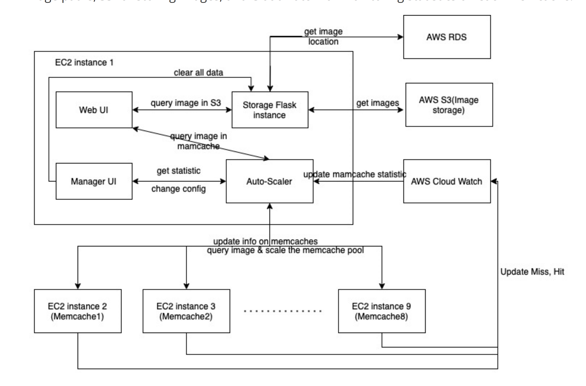
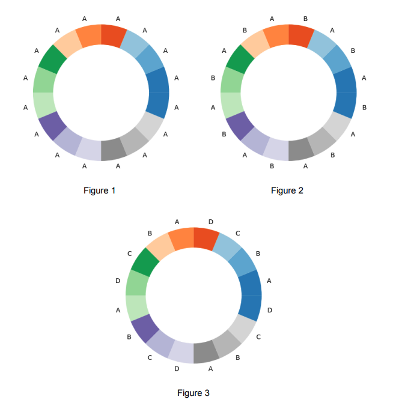

# AutoScalingImageStorageSystem

The Elastic Image Storage System is a scalable and efficient image storage and management solution that leverages various Flask components and AWS services. This README file provides an overview of the system, its components, and how to set it up.

## Table of Contents

1. [Introduction](#introduction)
2. [Components](#components)
    - [Flask Components](#flask-components)
    - [AWS Services](#aws-services)
3. [System Architecture](#system-architecture)
4. [Getting Started](#getting-started)
5. [Configuration](#configuration)
6. [Usage](#usage)
7. [Monitoring and Scaling](#monitoring-and-scaling)
8. [Contributors](#contributors)

## 1. Introduction

The Auto Scaling Image Storage System is designed to provide a scalable and reliable solution for storing and managing images. It consists of Flask components hosted on AWS EC2 instances and utilizes various AWS services including S3, RDS, CloudWatch for different aspects of the system.

## 2. Components

### Flask Components

1. **Web GUI Flask App**: This component provides a user-friendly web interface for uploading, managing, and retrieving images.

2. **Manager UI Flask App**: The Manager UI allows administrators to configure the system, monitor its performance, and manage user accounts.

3. **Image Storage Flask App**: Responsible for the storage and retrieval of images, as well as handling image metadata.

4. **Autoscaler Flask App**: The Autoscaler component dynamically adjusts the number of Memcache Flask Apps based on system load.

5. **Memcache Flask Apps (8 instances)**: These apps work together to cache frequently accessed data, improving system performance.

### AWS Services

1. **EC2 Instances**: The Flask components are hosted on AWS EC2 instances, providing scalable and reliable computing resources.

2. **RDS (Relational Database Service)**: RDS is used to store keys and image paths, facilitating efficient retrieval and management of image metadata.

3. **S3 (Simple Storage Service)**: S3 is used to store the actual image files, ensuring durability and availability.

4. **CloudWatch**: CloudWatch is employed for monitoring system statistics, particularly for the Memcache Flask Apps, enabling proactive performance management.

## 3. System Architecture

The Elastic Image Storage System architecture leverages the Flask components for user interaction and image management, AWS EC2 instances for hosting these components, RDS for database storage, S3 for image storage, and CloudWatch for monitoring system health. The Autoscaler Flask App ensures the system dynamically adapts to varying workloads by managing the number of Memcache Flask Apps.

## 4. Getting Started

Before deploying the system, make sure you have the necessary AWS credentials and resources set up. Clone this repository to your EC2 instances and follow the installation and configuration steps outlined in the individual Flask component README files.

## 5. Configuration

Each Flask component and AWS service may require specific configuration. Edit run_main.sh to modify RDE setting.

## 6. Usage

The system is designed for storing and managing images. Users can access the Web GUI to upload, retrieve, and manage images, while administrators can use the Manager UI to configure and monitor the system.

Detailed usage instructions can be found in the README files for each Flask component.

## 7. Monitoring and Scaling

CloudWatch is used for monitoring the health and performance of the Memcache Flask Apps. The Autoscaler Flask App ensures that the system scales dynamically to handle varying workloads.

AutoScaling Image Storage System employs a simplified form of consistent hashing that does not guarantee identical characteristics as the original version.

In the simplified consistent hashing approach, the entire range of possible key values is divided into 16 equally sized segments using MD5 hashing. The complete MD5 hash range spans from 0 to 2^128 - 1 in decimal, or 0 to FFFFFFFFFFFFFFFFFFFFFFFFFFFFFFFF in hexadecimal. To create 16 equally sized partitions within this hash range, it is essential to calculate the boundaries for each partition. In a hex representation, these 16 partitions can be defined as follows:
                Range beginning (hexadecimal)           Range end (hexadecimal)
Partition 1	:   0	                                    FFFFFFFFFFFFFFFFFFFFFFFFFFFFFFF
Partition 2	:   10000000000000000000000000000000	    1FFFFFFFFFFFFFFFFFFFFFFFFFFFFFFF
Partition 3	:   20000000000000000000000000000000	    2FFFFFFFFFFFFFFFFFFFFFFFFFFFFFFF
Partition 4	:   30000000000000000000000000000000	    3FFFFFFFFFFFFFFFFFFFFFFFFFFFFFFF
Partition 5	:   40000000000000000000000000000000	    4FFFFFFFFFFFFFFFFFFFFFFFFFFFFFFF
Partition 6	:   50000000000000000000000000000000	    5FFFFFFFFFFFFFFFFFFFFFFFFFFFFFFF
Partition 7	:   60000000000000000000000000000000	    6FFFFFFFFFFFFFFFFFFFFFFFFFFFFFFF
Partition 8	:   70000000000000000000000000000000	    7FFFFFFFFFFFFFFFFFFFFFFFFFFFFFFF
Partition 9	:   80000000000000000000000000000000	    8FFFFFFFFFFFFFFFFFFFFFFFFFFFFFFF
Partition 10:	90000000000000000000000000000000	    9FFFFFFFFFFFFFFFFFFFFFFFFFFFFFFF
Partition 11:	A0000000000000000000000000000000	    AFFFFFFFFFFFFFFFFFFFFFFFFFFFFFFF
Partition 12:	B0000000000000000000000000000000	    BFFFFFFFFFFFFFFFFFFFFFFFFFFFFFFF
Partition 13:	C0000000000000000000000000000000	    CFFFFFFFFFFFFFFFFFFFFFFFFFFFFFFF
Partition 14:	D0000000000000000000000000000000	    DFFFFFFFFFFFFFFFFFFFFFFFFFFFFFFF
Partition 15:	E0000000000000000000000000000000	    EFFFFFFFFFFFFFFFFFFFFFFFFFFFFFFF
Partition 16:	F0000000000000000000000000000000	    FFFFFFFFFFFFFFFFFFFFFFFFFFFFFFFF

For example: 

Given key "k1", we calculate its MD5 hash: B637B17AF08ACED8850C18CCCDE915DA. This hash would fall into Partition 12.
Given key "k2", we calculate its MD5 hash: 61620957A1443C946A143CF99A7D24FA. This hash would fall into Partition 7. 
Once we have the 16 partitions, we can assign different partitions to different memcache nodes. The following three figures illustrate the assignment of partitions to nodes for 1, 2, and 4 nodes. Take note of the alternating pattern that partitions are assigned to nodes.

Figure 1: One memcache node exits, A. All of the 16 partitions are assigned to memchache node A, meaning that A is responsible for all possible key values, and all requests are routed to A. 

Figure 2: A new memcache node is added, B. Now there are two memcache nodes, A and B. The 16 key partitions are divided between memcache nodes A and B, equally, using an alternating pattern. Now, approximately half of the requests should be routed to A, and half to B, depending on which node the key in the request has been assigned to. 

Figure 3: Two new memcache nodes are added, C and D. Now, there are four memcache nodes, A, B, C, D. The 16 partitions are re-divided between all four nodes, such that each node is responsible for one fourth of the possible key values. Approximately one fourth of all requests should be routed to each node. 

## 8. Contributors

Elastic Image Storage System is extended upon the ECE1779 Assignment 1 (Image Storage System)
Jiujiu Duan: S3 functionality, CloudWatch, AutoScaler, Memcache
Liangjing Xie: Web GUI Flask app, Manager UI Flask app, RDS
Chaoyue Gong: Deployment
